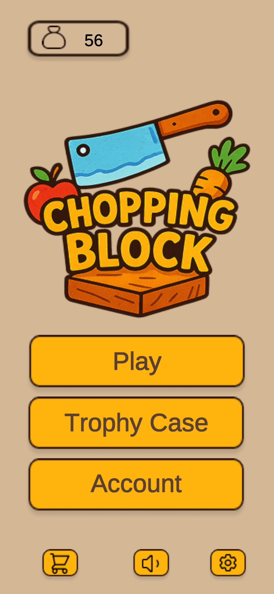

  

# 404-Found Presents: The Chopping Block

The Chopping Block is a Unity-built health equity game created from scratch by 404-Found to help students and younger kids build stronger food knowledge through play. The project was designed around a simple idea: healthy eating education works better when children are engaged, rewarded, and curious, not just instructed.

This app responds to a real nutrition problem. Too many kids are growing up surrounded by poor food choices, weak nutrition habits, and limited exposure to interactive learning tools that make healthy eating feel relevant. The Chopping Block turns that challenge into an active gameplay loop where players tap healthy foods, earn coins, unlock content, and learn more about what they eat.

## Demo

[Watch Chopping Block Demo V2](https://joshrfr.github.io/ChoppingBlock/)

  

Chopping Block Demo V2 is included in this repository for the beta release, and the README demo links route to the live beta demo page.

## What The App Does

- Teaches healthy food recognition through fast, approachable gameplay
- Rewards good choices with points, coins, and unlockable content
- Uses a Trophy Case to turn progress into nutrition discovery
- Supports replayability with score chasing, unlocks, and persistent progress
- Frames food education as something fun, not passive

## Why It Matters

404-Found built The Chopping Block to encourage healthier decision-making earlier in life. The goal was not only to expose kids to fruits and vegetables, but to make healthy food feel familiar, positive, and worth choosing again.

## Built In Unity

- Engine: Unity 6
- Language: C#
- Render Pipeline: Universal Render Pipeline
- Input: Unity Input System
- Persistence: PlayerPrefs via shared user data handling

## Core Gameplay And Product Areas

- Classic food-tapping gameplay
- Score, life, and game over flow
- Unlockable food collection
- Trophy Case progression
- Audio, menu, and settings systems
- Tutorial and onboarding support

## Team Overview

This public repository uses team aliases only.

- Josh O. focused on systems integration, persistence, settings/account flows, and major menu/application wiring.
- Nigel B. focused on core gameplay systems, food unlock logic, debugging, and gameplay-to-game-over flow improvements.
- Kendall H. focused on major scene work, especially Game Over and Classic Tutorial presentation and UI progression.
- Mike J. helped keep the project organized, documented, and product-focused through business analysis and QA support across development.

Source-control-backed contribution details are documented in [docs/CONTRIBUTIONS.md](docs/CONTRIBUTIONS.md).

## Repository Scope

This repository is a public portfolio snapshot of the beta release Unity project workspace exported from Unity Version Control `/main` at `cs:46` head.

Included:

- Custom game scenes
- Custom scripts
- Game sprites, audio, prefabs, fonts, and resources needed for the application
- Unity package and project settings required to open the project

Excluded:

- Unity generated folders like `Library`, `Temp`, `Logs`, `obj`, and `UserSettings`
- Recovery files and deprecated scene backups
- Local workspace metadata and private Unity Version Control files
- Unnecessary third-party demo/example content not needed to present the shipped application work

More detail is in [docs/REPO_SCOPE.md](docs/REPO_SCOPE.md).

## Opening The Project

1. Install Unity 6 compatible with the project version in `ProjectSettings/ProjectVersion.txt`.
2. Open this folder through Unity Hub.
3. Let Unity restore generated folders on first load.

## Contribution Evidence

Contribution details in this repo are summarized from the project's Unity Version Control history and aligned to the team roster so employers and collaborators can quickly see who drove each area of the application.
